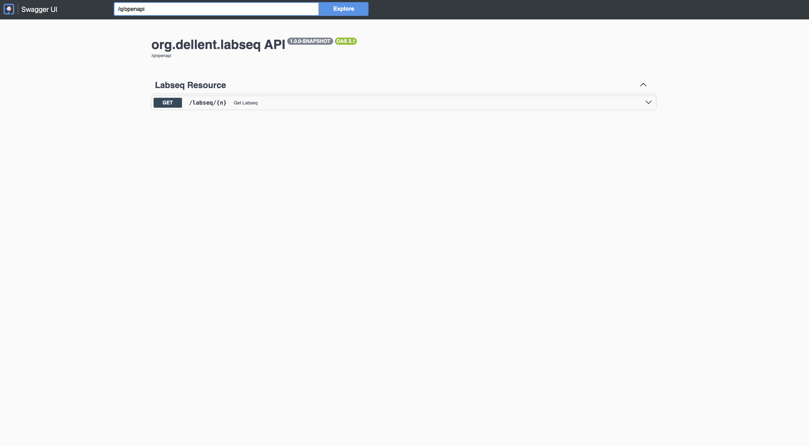
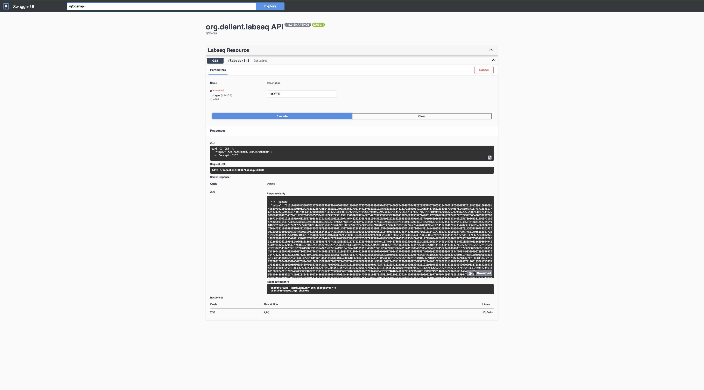

# Labseq (exercise Dellent)

## Execution instructions:

### Local mode (dev)

1. Ensure that Java 17+ is installed.
2. In the root of the project, run:
   ```sh
   ./mvnw quarkus:dev
   ```
3. Access:  
   http://localhost:8080/labseq/{n}

4.	Swagger/OpenAPI documentation will be available at:
    http://localhost:8080/q/swagger-ui/

### Container mode (Docker)

1.	Build the project JAR:
   ```sh
   ./mvnw package
   ```

2.	Build the Docker image:
   ```sh
   docker build -f src/main/docker/Dockerfile.jvm -t labseq-app .
   ```

3.	Run the container:
   ```sh
   docker run -i --rm -p 8080:8080 labseq-app
   ```

4.	The service will be available at:  
   http://localhost:8080/labseq/{n}

5.	Swagger/OpenAPI documentation will be available at:
   http://localhost:8080/q/swagger-ui/


## To run the tests:


To execute the project’s unit tests, run the following command from the project root:
```sh
./mvnw test
```

These tests ensure that the labseq logic is correct and that no negative values are returned for n >= 0.

## Explanation of the caching mechanism:

The labseq service uses Quarkus’ caching mechanism through the @CacheResult annotation on the main method responsible for computing the sequence. This ensures that, for every previously calculated n, the result is stored and instantly returned on future calls to the endpoint, significantly improving performance for repeated values.

### Cálculos intermédios:

- **Iterative version (implemented):**
    - The calculation of l(n) is done iteratively, filling a local array with all intermediate values up to n in a single pass. This method is highly efficient (O(n) complexity) and does not require caching for intermediate calculations, as each value is computed only once per request.
	- Quarkus’ caching is used to store the final result of each n, speeding up repeated calls to the same endpoint.
- **Note on the original statement:**
  	- The original statement suggests that caching should also be used for intermediate calculations. In a recursive version, this would happen naturally, as each sub-call would be cached. However, the iterative version is more efficient and, by design, does not require caching for intermediate values since they are kept in local memory during execution.
	- This approach ensures maximum performance and avoids stack overflow issues, making it the most suitable solution for very large values of n.

 
 ## Swagger

Below are the screenshots of the Swagger:

### Endpoint Overview



### Requesting (n = 100000)

